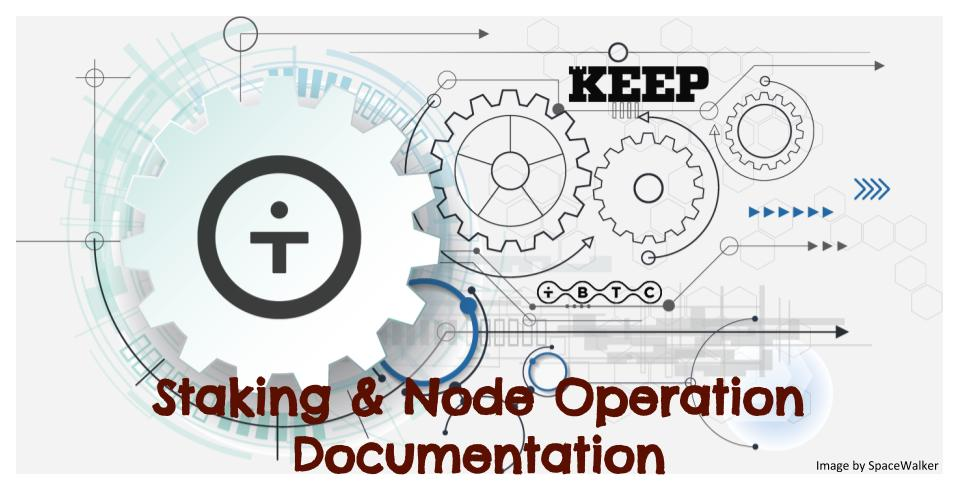

# Getting Started
In this guide, you'll find all the information you need to stake on the Keep Network and start earning rewards.

## Basic Description - tl;dr
The Keep Network's native token, a KEEP, powers the network and undergirds all the apps that are and will be built on it. Anyone with KEEP tokens can stake them, setting them aside as collateral for Keep Network operations.

Staked tokens are delegated by a KEEP token holder to an operator address, who performs work on the network. This work contribution is rewarded, but if an operator misbehaves and doesn't follow their operator contract, their collateral can be taken away (stake slashing) as punishment.

## Contents

- [Introduction]((basics/intro.md)) : Intro and context to Keep and tBTC.
- [Key Reasons for Staking in Keep Network:](Reasons/reasons.md) Understand why it is meaningful to stake in Keep Network.
- [Comparison with Other Alternatives:](comparison/comparesimilar.md) Compare Keep Staking with other staking alternatives currently available in crypto.
- [Staking Documentation:](stakingdoc/keep101.md) Official Keep Team's documentation about staking. 
- [Staking Options:](stakingdoc/stakingoptions.md) With staking partners or on your own node running on a server.
- [Node Operation:](Node-Operation/intro-operation.md) Deploy, Manage, Troubleshoot your own node.
- Keep Token Dashboard: Token Dashboard official user guide.

---
`Sourced from Keep Team's official documentation and edited & completed by community.`[Source](https://keep-network.gitbook.io/staking-documentation/)

`Contributors: Ramaruro, EstebanK`
